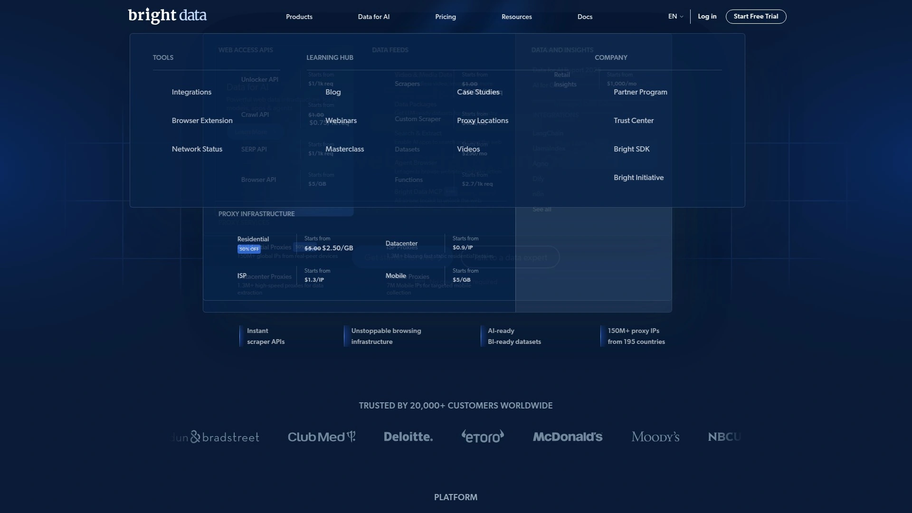
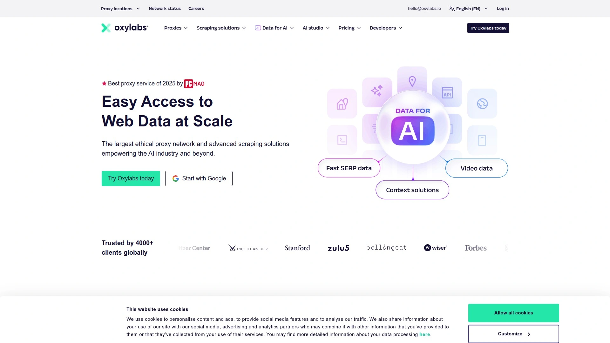

# Top 12 Best Proxy Services Ranked in 2025 (Latest Compilation)

Finding reliable proxy solutions can feel like navigating a maze. You want speed, stability, and global coverage without burning through your budget or dealing with constant IP blocks. Whether you're scraping data for market research, managing multiple accounts, or just trying to access geo-restricted content, the right proxy makes all the difference.

I've spent weeks testing proxy services across every major category—residential, datacenter, ISP, and mobile. Some providers promise millions of IPs but deliver spotty connections. Others charge premium prices for features you'll never use. This guide cuts through the noise, ranking twelve proven proxy services that actually deliver on their promises.

## **[Proxy-Sale](https://proxy-sale.com)**

High-speed proxies with instant activation, perfect for web scraping and multi-account operations without restrictions.

Proxy-Sale (now operating as Geonix) brings over ten years of proxy experience to the table, and it shows. The service supports both HTTPS and SOCKS5 protocols right out of the box, which means you're covered whether you need simple web scraping or more complex automation tasks.

Their infrastructure stands out with instant activation—no waiting around for your proxies to go live. The bandwidth is genuinely high-speed, and they've built their network with flexibility in mind. You get dedicated residential IPs, ISP proxies for stable long-term sessions, mobile proxies from real carrier networks, and datacenter options when raw speed matters most.

What makes them practical is the approach to customization. You can configure session lengths, choose from multiple geographic locations, and switch between proxy types depending on what your project needs. The interface keeps proxy management straightforward with easy renewal options and special discounts if you're a returning customer. Their residential proxies use real user connections sourced through voluntary agreements, which helps maintain a clean IP reputation. Support runs around the clock, which matters when you hit technical snags at odd hours.

For anyone running SEO campaigns, e-commerce monitoring, or social media automation, the combination of speed, stability, and diverse proxy types gives you room to scale operations without constantly fighting blocks or timeouts.

## **[Bright Data](https://brightdata.com)**

Enterprise-grade proxy platform with advanced data collection tools and massive global IP coverage.

Bright Data operates what might be the industry's most comprehensive proxy infrastructure. Their network spans 150 million residential IPs across 195 countries, backed by 770,000 datacenter proxies and 700,000 static residential IPs.

The platform goes beyond basic proxy services. Their Web Unlocker technology promises near-perfect success rates by automatically handling CAPTCHAs and anti-bot systems. The Proxy Manager—an open-source tool available for Windows, macOS, and Linux—gives you granular control over IP rotation, bandwidth optimization, and custom routing rules.

What sets Bright Data apart is the level of enterprise support. You get dedicated account managers, detailed usage analytics breaking down success rates and response times, and the ability to target locations down to specific ZIP codes or ASN numbers. Their infrastructure uses strategically placed gateway servers for efficient routing, and you can cache recent page visits to reduce costs by up to 5%.

The pricing structure reflects the premium positioning. Residential proxies start at around $2.94/GB, with costs decreasing on larger volume commitments. It's expensive compared to budget options, but Fortune 500 companies and major universities rely on Bright Data for mission-critical data operations.

The dashboard might feel overwhelming for newcomers—there's simply a lot of functionality packed in. But for teams running large-scale scraping operations, ad verification across multiple markets, or competitive intelligence gathering, having this much control becomes necessary rather than excessive.

## **[Oxylabs](https://oxylabs.io)**

Premium proxy provider delivering exceptional performance for enterprise web scraping and data collection.

Oxylabs controls a proxy pool exceeding 100 million residential IPs and 2 million datacenter addresses, with coverage spanning 195 countries. Their infrastructure consistently delivers what matters most: speed and reliability. Response times average 0.41 seconds for residential proxies with success rates hitting 99.82% in independent testing.

The platform offers sophisticated targeting options including country, state, city, ASN, ZIP code, and even GPS coordinates for residential proxies. This level of precision helps when you need to test localized content or gather region-specific market data. Their concurrent session limits are effectively unlimited—as long as your account balance holds, you can scale operations without artificial bottlenecks.

Oxylabs targets the premium segment with pricing to match. Residential proxies start at $4/GB, while ISP proxies begin at $1.60 per IP for small volumes. The platform includes a 7-day free trial for businesses and offers dedicated support with account managers who actually understand technical proxy challenges.

What makes Oxylabs worth the premium is consistency. Their network rarely throws unexpected errors, the IP quality stays high across different target websites, and the infrastructure scales smoothly from hundreds to millions of requests. For teams where downtime translates directly to lost revenue, that reliability pays for itself.

## **[Decodo](https://decodo.com)**

Best value provider combining affordability with award-winning support and extensive proxy features.

Decodo (formerly Smartproxy) hits a sweet spot between cost and capability. Their network includes 115 million residential IPs covering 195 countries with city-level targeting options. Performance testing shows 99.86% success rates and response times averaging 0.63 seconds—competitive with providers charging significantly more.

The platform makes sense for teams that want professional-grade proxies without enterprise-level budgets. Residential proxies start at $3.50/GB, static residential at $0.27/IP, and mobile proxies at $2.25/GB. More importantly, Decodo includes features that competitors charge extra for: free geo-targeting, browser extensions, and integration with their custom X Browser for multi-accounting work.

Their dashboard focuses on usability rather than overwhelming you with options. You can configure sticky sessions up to 24 hours, choose between HTTP/HTTPS and SOCKS5 protocols with UDP support, and manage authentication through credentials or IP whitelisting. The documentation is thorough, covering common integration scenarios without requiring you to contact support for basic setup questions.

What distinguishes Decodo is their customer service approach. Support runs 24/7 and has won industry awards for responsiveness and problem-solving. When you're troubleshooting a scraping issue at 2 AM, having knowledgeable support who responds quickly makes the difference between meeting deadlines and missing them.

The platform also offers a full scraping API suite, including AI Parser for converting HTML to structured data and a Video Downloader for bulk content analysis. For teams that need more than just proxy access, these integrated tools eliminate juggling multiple services.

## **[SOAX](https://soax.com)**

AI-powered proxy routing with flexible filtering and precision targeting for mid-range budgets.

SOAX operates a proxy network exceeding 190 million IPs across residential, mobile, ISP, and datacenter types—all accessible through a single subscription. Their AI-powered routing system automatically optimizes connections, handles CAPTCHA challenges, and adjusts to avoid blocks without manual intervention.

The platform's targeting capabilities go granular. You can filter by country, region, city, and ISP, then lock sessions for durations ranging from one minute to an hour. This flexibility helps when you're testing different approaches or need to maintain consistent identity across multiple requests to the same target.

Pricing starts at $3/GB for residential traffic on their starter plan (25-30GB minimum), with rates dropping to $2.49/GB at higher volumes. ISP and datacenter proxies come bundled with the residential access, giving you options to shift between proxy types based on what specific targets demand.

SOAX's real-time analytics dashboard tracks your success rates, response times, and traffic usage across different proxy types. When something isn't performing as expected, having this visibility helps diagnose whether the issue is proxy selection, target defenses, or configuration problems.

The platform works particularly well for users running ad verification checks, conducting SEO research, or managing social media accounts at scale. The combination of diverse IP types, intelligent routing, and responsive support (available 24/7) provides the tools needed for these scenarios without requiring you to become a proxy expert.

## **[IPRoyal](https://iproyal.com)**

Budget-friendly proxy service with genuine ethically-sourced IPs and excellent customization options.

IPRoyal delivers solid proxy services without the premium price tags that dominate this space. Their network includes over 32 million residential IPs across 195 countries, plus datacenter, mobile, and ISP options. Trustpilot ratings consistently hit 4.6 stars, reflecting reliability that matches pricier competitors.

The platform's strength lies in customization. You can select locations with city-level precision, configure rotation intervals, choose between HTTP/HTTPS and SOCKS5 protocols, and set up either sticky sessions or instant IP changes. For residential proxies, pricing starts at $1.75/GB—among the most affordable options for legitimate, ethically-sourced IPs.

IPRoyal's infrastructure supports unlimited concurrent sessions, which matters when you're scaling operations across multiple targets simultaneously. Their IP authentication system allows up to three whitelist slots, and the platform integrates smoothly with over 650 different tools and software packages commonly used for scraping, automation, and account management.

One practical advantage is their ISP proxy offering. These combine datacenter speed with residential legitimacy, starting at $1.80 per IP for dedicated access. When you need stable, long-duration sessions without the cost variability of pay-per-GB residential proxies, ISP proxies often fit better.

The interface keeps things simple. You configure your proxy parameters, receive connection details, and plug them into your tools. Support is available around the clock, and users consistently report helpful responses to technical questions rather than generic troubleshooting scripts.

## **[NetNut](https://netnut.io)**

Direct ISP partnerships delivering exceptional speed for large-scale residential proxy operations.

NetNut's approach centers on direct agreements with internet service providers, giving them access to 85 million residential IPs across 195 countries plus 1 million static addresses. This direct-to-ISP model results in response times under 200 milliseconds for US targets—noticeably faster than proxy networks relying on peer-to-peer infrastructure.

The platform supports both sticky sessions (maintaining the same IP until disconnect) and rotating sessions (new IP with each request). You can target specific US states or cities, and the API allows programmatic control over proxy selection and session management. Their datacenter pool adds 150,000 IPs when raw speed matters more than residential authenticity.

Pricing follows a traffic-based model starting at $99/month for 28GB, which works out to roughly $3.53/GB. The professional tier with 800GB drops to $2.49/GB, making it competitive for teams with consistent high-volume needs. NetNut doesn't offer pay-as-you-go billing, so you're committing to monthly allocations.

The dashboard provides detailed usage statistics beyond simple traffic tracking. You see success rates, response times, and connection error breakdowns, which helps optimize your scraping configurations rather than blindly adjusting parameters. For teams treating proxy performance as a KPI, this visibility matters.

NetNut works best for experienced users running serious data operations. The pricing structure favors volume, the feature set assumes technical competence, and the whole platform is designed around consistent large-scale usage rather than occasional light needs.

## **[Rayobyte](https://rayobyte.com)**

Ethical sourcing and non-expiring packages with unlimited bandwidth for predictable proxy costs.

Rayobyte (formerly Blazing SEO) built their reputation on datacenter proxies but now offers 36 million residential IPs across 150+ countries. Their standout feature is traffic that never expires—buy it once, use it whenever, without monthly renewal pressure.

The residential proxy plans include full HTTP protocol support with country, state, and city targeting. Sessions can run for up to 120 minutes, which works well for tasks requiring sustained connections to the same target. The pricing model is competitive at $3.50/GB, and you can take advantage of a small 2-day trial with 50MB to test their network before committing.

For static residential (ISP) proxies, Rayobyte offers both dedicated and semi-dedicated options with automatic rotation available. The dedicated IPs give you exclusive access within US locations, while semi-dedicated options (shared with up to two other users) cover US, UK, Canada, and Germany at lower cost. Pricing starts at $5/IP monthly for starter plans with 5-99 proxies.

Rayobyte's platform includes some limitations—no IP whitelisting or SOCKS5 support for residential proxies, and the dashboard could use modernization. The proxies also tend to run slower than top performers, with response times up to three times longer in testing. That said, for teams prioritizing ethical IP sourcing, predictable costs, and don't require cutting-edge speeds, Rayobyte delivers solid value.

The company emphasizes ethical practices and transparent sourcing, which matters for businesses concerned about compliance and reputation. Support is available via tickets, email, and Slack for select customers, though it lacks the instant live chat some competitors provide.

## **[Webshare](https://webshare.io)**

Absolute self-service with highly customizable subscriptions and strong datacenter proxy performance.

Webshare focuses on datacenter and ISP proxies, with residential offerings as a secondary product line. Their datacenter network is their strength—offering 50+ countries, SOCKS5/HTTP support, and high concurrency up to 3,000 threads.

The platform's pricing model stands out for flexibility. Datacenter proxies start as low as $0.029 per proxy, and you can get 10 free datacenter proxies with 1GB monthly bandwidth indefinitely without needing a credit card. Static residential proxies begin at $0.30/IP, making them among the most affordable in this category.

Webshare's residential proxy network includes 80 million IPs across 195 countries, though it lacks some standard features like city targeting and customizable rotation intervals. Performance testing shows 99.58% success rate with 1.49 second response times—slower than leaders but solid enough for most use cases.

The dashboard emphasizes simplicity and API access. You can generate proxy lists programmatically, manage authentication through IP whitelisting or credentials, and integrate with common scraping frameworks without friction. Support runs via email and chat during specific hours (11PM-11AM PST), so availability isn't quite 24/7.

For users who know exactly what they need and want maximum control over their proxy configuration without paying for bundled services they won't use, Webshare delivers. The platform assumes technical competence but rewards it with granular control and cost-effective pricing.

## **[Nimble](https://nimbleway.com)**

AI-optimized proxy intelligence with lightning-fast 0.25s response times for modern data teams.

Nimble (formerly Nimbleway) applies artificial intelligence to proxy selection, matching every request to optimal IPs based on target website, user behavior, and historical performance patterns. Their optimization engine learns over time, theoretically improving success rates as you use the service more extensively.

The network provides global residential proxy coverage with country, state, and city targeting, plus ASN locking for maintaining consistent ISP characteristics throughout longer sessions. They've introduced "geo-sessions" designed to last days or weeks by selecting only proven stable IPs and replacing them intelligently when rotation is necessary.

Response times average 0.25 seconds per request, and Nimble guarantees 99.99% uptime backed by auto-scaling infrastructure that handles unlimited concurrent requests. For teams building multiple data pipelines simultaneously, this scalability matters.

Pricing starts at $8/GB for pay-as-you-go residential proxies, dropping to $6.10/GB on larger commitments. The platform also offers various scraping APIs—Web, SERP, E-commerce, and Maps—with AI-powered parsing and automatic CAPTCHA handling included.

Nimble works best for technically sophisticated teams that value automation and intelligence over manual configuration. The AI engine's benefits become apparent with consistent usage rather than sporadic projects. Their G2 rating of 5/5 (though on limited reviews) and Trustpilot score of 4.1 suggest early users are finding value in this differentiated approach.

## **[Geonode](https://geonode.com)**

Developer-friendly proxies with owned infrastructure and pay-as-you-go flexibility for web scraping projects.

Geonode owns and operates its proxy infrastructure rather than reselling IPs, which translates to better control over speed, reliability, and trustworthiness. Their network includes over 2 million residential and datacenter IPs spanning 190+ countries.

The platform targets developers and data teams with straightforward pricing: $3/GB for pay-as-you-go residential traffic, with subscription plans offering volume discounts down to $2/GB. They back this with a 99% request success rate and average response times around 500 milliseconds.

Geonode provides full GDPR compliance and ethical IP sourcing, with sticky sessions configurable from 5 to 60 minutes depending on your needs. The service supports HTTP/HTTPS and SOCKS5 protocols, with country/city targeting and ISP filtering available through their API.

Integration options include both a browser extension and REST API, making it easy to plug into existing workflows. The dashboard keeps complexity minimal—you set your targeting parameters, generate credentials, and connect. For teams that value transparent operations without excessive features, this simplicity works.

A $5 trial provides 10GB over 3 days, letting you properly test the network before committing. Their Trustpilot rating of 4.7 reflects satisfaction with both service quality and support responsiveness. While Geonode doesn't offer ISP or mobile proxies yet, for standard web scraping and data collection using residential or datacenter IPs, they deliver solid performance at fair prices.

## **[HydraProxy](https://hydraproxy.com)**

Flexible short-term proxy plans with unlimited bandwidth and mobile fingerprinting technology.

HydraProxy differentiates itself with short-term rental options—12 to 24-hour access packages for users needing proxies for specific limited-duration projects. Their network includes over 5 million residential IPs plus 4G mobile proxies, particularly strong in the USA.

The platform offers unlimited bandwidth across all proxy types, which matters for data-intensive operations where traffic costs can spiral unpredictably. They've implemented mobile fingerprinting technology to enhance anonymity beyond what typical residential proxies provide, making detection harder for advanced anti-bot systems.

HydraProxy supports highly configurable proxy rules, letting you define specific network behaviors tailored to your exact requirements. The 4G rotating proxies automatically refresh IPs while maintaining real mobile network connections, helping bypass platform security measures that flag datacenter or standard residential IPs.

Pricing uses pay-as-you-go models, and notably, they don't require monthly commitments or impose hidden fees. This flexibility suits teams running sporadic campaigns rather than continuous operations. That said, HydraProxy lacks browser extensions, API documentation, and live chat support—only email assistance is available.

The service works well for social media automation, sneaker botting, and ad verification where mobile IPs provide significant advantages. For longer-term, high-volume needs, other providers with more robust infrastructure and support systems might serve better. But when you need clean mobile IPs for a specific project window without long commitments, HydraProxy delivers.

***

## Common Questions About Proxy Services

**How do I choose between residential and datacenter proxies?**

Residential proxies come from real household devices, making them harder to detect but slower and more expensive. Use them for accessing websites with strong anti-bot protection, managing multiple accounts, or scraping sites that aggressively block datacenter IPs. Datacenter proxies run faster and cost less but are easier to identify—they work well for less-restrictive targets, high-volume operations where speed matters, or testing environments where occasional blocks don't halt your workflow.

**What success rate should I expect from quality proxies?**

Premium residential proxy services typically deliver 99%+ success rates on standard targets, though this drops when websites implement advanced anti-bot measures. Factors affecting your results include target website defenses, proxy type selection, rotation strategy, and request patterns. If you're consistently seeing success rates below 95% on mainstream sites, check your configuration first, then consider testing alternative providers. Don't just accept poor performance as normal.

**How can I evaluate proxy speed beyond advertised response times?**

Run your own tests against your actual target websites rather than relying on provider benchmarks. Measure both connection speed and success rate over sustained periods—some proxies start fast but degrade under load. Test during peak hours when networks face maximum stress. Track how often you hit timeouts versus getting responses, even slow ones. Geographic proximity between proxy location and target server matters, so test the regions you'll actually use rather than just the fastest-performing zones.

---

## Why Proxy-Sale Fits Most Scenarios

Proxy-Sale delivers where it counts: instant activation eliminates waiting, diverse proxy types (residential, ISP, mobile, datacenter) give you flexibility to match different targets, and competitive pricing with special discounts for returning customers keeps costs manageable as you scale. Their ten-plus years of operation translate to infrastructure stability and responsive 24/7 support when you inevitably hit configuration challenges.

For teams running web scraping operations, managing multiple e-commerce accounts, or conducting competitive research across geographic markets, having access to this range of proxy types through a single provider simplifies operations considerably. [Visit Proxy-Sale](https://proxy-sale.com) to explore their plans and find what fits your specific needs.
